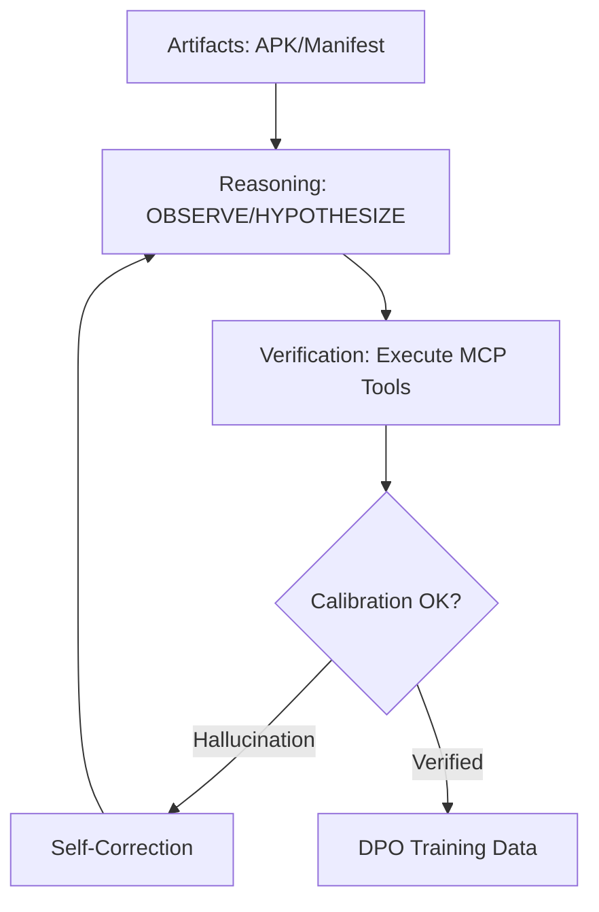

# AgenticART

**Verifiable Security Research & Dynamic Analysis**

---

## The Problem

LLMs generate exploit code that **looks correct** but doesn't run:

- Uses APIs that don't exist (`frida.hooks.Hook`)
- Invents kernel structures and syscalls
- Never receives execution feedback

**Root cause:** Models pattern-match syntax without knowing what actually executes.

---

## The Solution

AgenticART creates a **Praxis Loop**: a reasoning-to-verification feedback loop between the model and a real Android device:

**Failures become intelligence.** The model learns to match its confidence to reality through empirical verification.

---

## Key Results

| Metric | Result |
|--------|--------|
| Reasoner Model | **Qwen 2.5 Coder 32B** |
| Reasoning Improvement | **+80 percentage points** |
| Zero-Shot Pass Rate | **43% (on Android 11/14 benchmarks)** |
| Challenge Curriculum | 31 Reasoning Challenges (V2) |

---

## Belt Progression

Models advance through structured difficulty levels:

| Belt | Focus | Belt | Focus |
|------|-------|------|-------|
| ⬜ White | ADB fundamentals | 🟦 Blue | CVE exploitation |
| 🟨 Yellow | Reconnaissance | 🟪 Purple | Evasion |
| 🟧 Orange | Vulnerability mapping | 🟫 Brown | Attack chaining |
| 🟩 Green | Scripting (Frida, Python) | ⬛ Black | Advanced Proficiency Test |

---

## Requirements

| Data Collection (any machine) | Fine-Tuning (GPU machine) |
|------------------------------|---------------------------|
| Python 3.10+ | NVIDIA GPU 16GB+ VRAM |
| Android emulator | PyTorch 2.0+ with CUDA |
| [Ollama](https://ollama.ai) | Or use Google Colab (free T4) |

---

## Documentation

| Guide | Description |
|-------|-------------|
| [Quick Start](quickstart.md) | Get running in 5 minutes |
| [Architecture](architecture.md) | System design and V2 implementation |
| [Dojo Framework](DOJO_FRAMEWORK.md) | Training methodology and curriculum |
| [RAG System](RAG_SYSTEM.md) | Knowledge retrieval for context augmentation |
| [MCP Integration](MCP_INTEGRATION.md) | Tool execution protocol |
| [Setup Guide](SETUP.md) | Detailed installation instructions |

---

## Research

Inspired by [**"LLM-Powered Android Exploitation"**](https://arxiv.org/abs/2509.07933) which introduces the feedback loop methodology.

---

**For authorized security testing only.**

⬜ → 🟨 → 🟧 → 🟩 → 🟦 → 🟪 → 🟫 → ⬛

